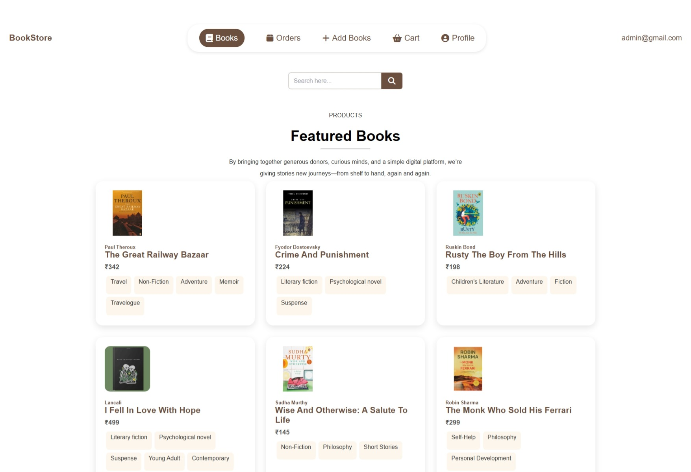
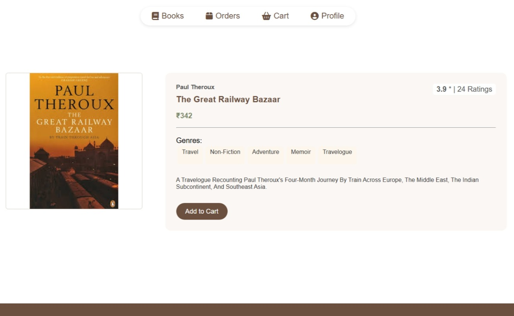
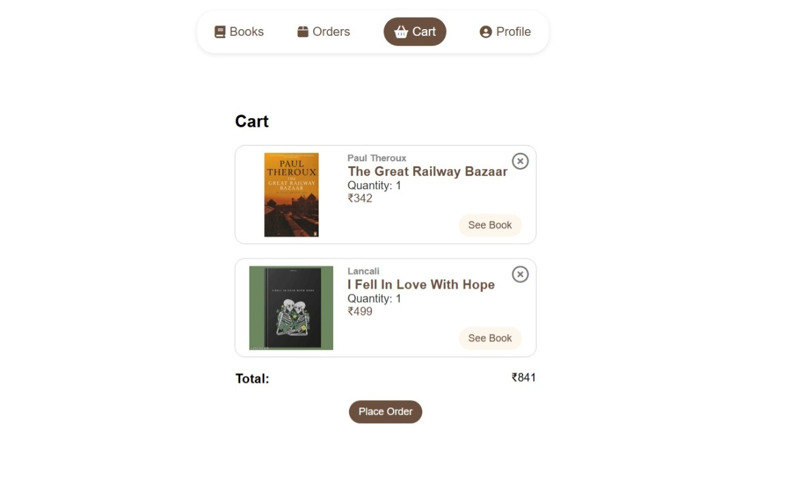
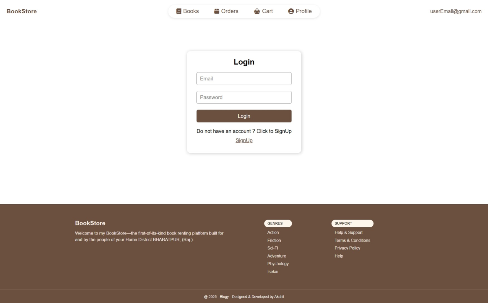
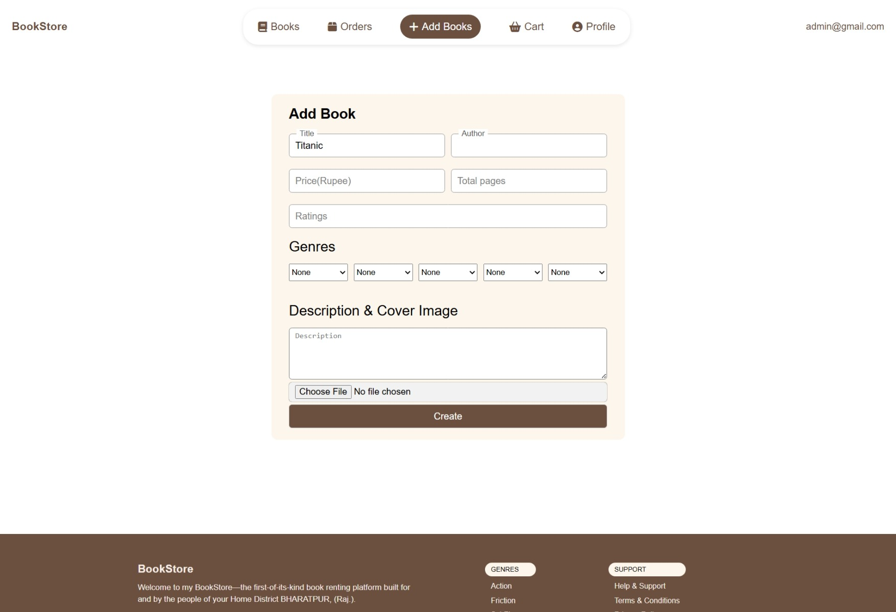

# 📚 BookStore – MERN Stack Project

A full-stack MERN Bookstore application with authentication, cart, orders, admin book management, and image upload using Cloudinary.

🔗 Live Demo
https://bookstore-akshit.netlify.app/register

## 🚀 Features

👤 User

- User registration & login (JWT authentication)
- Browse books
- View book details
- Add/remove books from cart
- Place orders
- Order history

🛠️ Admin

- Add new books
- Upload book cover images (Cloudinary)
- Manage book availability

## 🛠 Tech Stack

Frontend

React
- Context API
- React Router
- CSS

Backend

- Node.js
-Express.js
-MongoDB (Mongoose)
-JWT Authentication
-Cloudinary (Image upload)

Deployment

- Frontend: Netlify
- Backend: Render
- Database: MongoDB Atlas

## 📸 Screenshots

### Home Page


### Book Details


### Cart


### Login / Register


### Admin Panel


## Setup
```bash
# frontend
cd bookstore_frontend
npm install
npm start

# backend
cd bookstore_backend
npm install
npm run dev

## 🧑‍💻 Author
Akshit Sisodia
